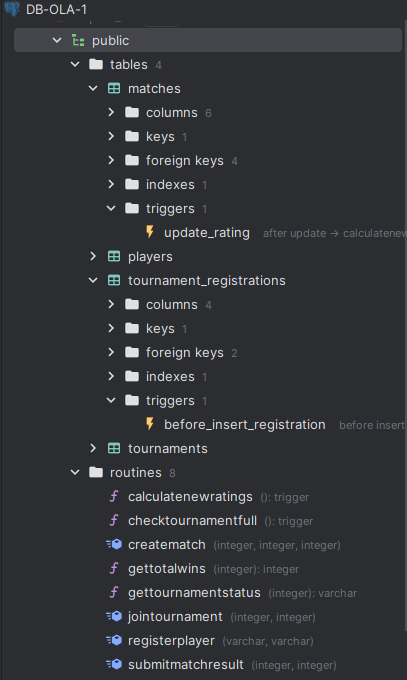
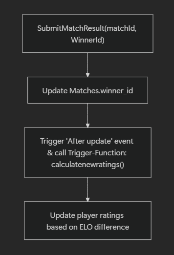
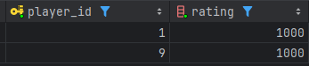
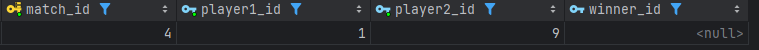
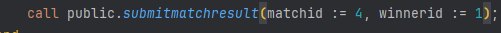
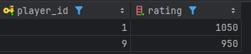
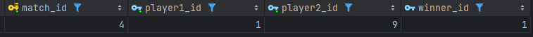

Vi har lavet en persistScript.sql så vu bare kan køre den når vi vil redo persistence. Den er ændret lidt fra fill_script.sql, så der findes tournaments med færre end max anatallet af spillere så vi kan teste at joine en full tournament vs. en åben en, osv.

## Korrekt brug

Start først med at køre [sql/create_script.sql](/sql/create_script.sql) som indeholder tables og triggers (og deres trigger functions inkluderet også.)

Derefter kan du køre [sql/persist_script.sql](/sql/persist_script.sql) hvis du vil, da den skaber en function der kører det samme som fill_script.sql gør, bortset fra det her script har mangler så man kan tilmelde sig tournaments osv; så ikke alle tournaments bare er fulde, og den laver en function mere.

Kør [sql/functions.sql](/sql/functions.sql)

Til sidst [sql/procedures.sql](/sql/procedures.sql)

# Dokumentation af part 3: funktionelle functions, procedures og triggers

Som udgangspunkt skal vi tjekke om vores værktøjer bliver registreret korrekt og til den rigtige database.

Som kan ses på følgende billede, får vi med vores SQL scripts skabt vores diverse funktioner

<div style="display: flex; align-items: center;">
    
    <ul>
        <p style="font-size: 110%">
    Billedet til venstre viser vores nuværende opsætning af databasen, heraf med de 4 ønskede tabeller til Esport. Endvidere har vi med vores diverse scripts i folderen <a href="../sql/create_script.sql">SQL</a>
        </p>
        <hr>
        <li>Triggers er skabt med de ønskede navne som fremstår af opgaven</li>
        <li>Procedures og Functions er også skabt med rigtige navne og fremstår nederst i folderen "routines"</li>
        <li> Vi har med vores scripts (når kørt i den rigtige røkkefølge) gjort det nemt at få de diverse værktøjer sat op.
        </li>
<hr>
        <p>
        Keywordet <span style=" color:orange; font-weight: bold; font-size:110% " >Create</span> i SQL sikrer at en entitet bliver skabt. Dette er universelt for Relationer, funktioner, procedures og triggers mm. og skaber som typisk en genandvendelig instans af "noget" i databasen.
        </p> </ul>
</div>

---

Med vores instanser nu skabt, vil denne dokumentation demonstrere og sikre at funktionaliterne kører som de skal og at data-persistence er modereret korrekt.
Denne dokumentation vil købe igennem de forskellige operations-instanser vi har lavet, redegøre for dem og vise et eksempel på deres brug og validering.

## Stored procedures

Kort sagt er stored procedures SQL queries/interaktioner, pakket ind i en instans man kan kalde med

```
CALL MyProcedure()
```

Som typisk kan procedures ikke bruges i andre queries, og er udelukkende for at 'gemme' længere kode-eksekveringer til simple "calls".

<div style="border: 1px solid #ccc; border-radius: 8px; padding: 16px; display: flex; align-items: center; background-color:rgb(43, 40, 40);">
    
    <div>
        <strong>OBS:</strong> med OUT (output) kan man alligevel bruge procedures i andre queries. Ellers er Functions den bedste måde at håndtere komplekse queries, ligesom Views forenkler dem.
    </div>
</div>

---

### Eksempel: Submitting a Match result

<div style="display: flex; align-items: center;">
    
    <div>
        <ol style="list-style-type: none;">
            
            
            </li>
            <li style="display: flex; align-items: center; flex-direction: column;">
                <span style="font-size: 24px; font-weight: bold;">↓</span>
                
            </li>
            <li style="display: flex; align-items: center; flex-direction: column;">
                <span style="font-size: 24px; font-weight: bold;">↓</span>
                
            </li>
            <li style="display: flex; align-items: center; flex-direction: column;"> 
                <span style="font-size: 24px; font-weight: bold;">↓</span>
                
            </li>
        </ol>
    </div>
</div>

## 1. Metoden `SubmitMatchresult` kaldes:

```sql
create procedure submitmatchresult(IN matchid integer, IN winnerid integer)
    language plpgsql --postgreSQL dialekt
as
$$
BEGIN
    UPDATE matches
    SET winner_id = winnerId
    WHERE match_id = matchId;

    -- Denne metode opdaterer kun winner_id, resten af funktionaliteten er sat over i trigger funktionen.
END;
$$;
```

Denen metode kører en meget simpel opdatering til `Matches` relationen, hvilket lader os anvende Functions og Triggers til resten af funktionaliteten så vi har et eksemplarisk flow.

<div style="border: 1px solid #ccc; border-radius: 8px; padding: 16px; display: flex; align-items: center; background-color:rgb(43, 40, 40);">
    
    <div>
        <strong>OBS:</strong> Vi kunne sagtens have haft hele funktionaliten kørt udelukkende i vores Procedure
    </div>
</div>

## 2. Trigger: Ændring til Matches.winner_id opfanget

```sql
create trigger update_rating
    after update
        of winner_id -- specifikt når winner_id ændres, skal funktionen køre
    on matches
    for each row -- "for each" fordi det er "best practice" at sikre mod bulk-updates og fungerer fint med vores single-update purpose
execute procedure calculatenewratings();
```

Vores trigger bliver ramt, hvilket sikrer at når winner_id er opdateret, så skal der beregnes nye rating for involverede players.

## 3. Calculating new ratings

```sql
create function calculatenewratings() returns trigger
    language plpgsql
as
$$
BEGIN
    UPDATE players
    SET rating = rating +
                 (50 * (1 / (1 + POWER(10, (SELECT rating FROM players WHERE player_id =
                                                                             CASE WHEN NEW.winner_id = NEW.player1_id THEN NEW.player2_id ELSE NEW.player1_id END) -
                                           (SELECT rating FROM players WHERE player_id = NEW.winner_id)) / 400.0)))
    WHERE player_id = NEW.winner_id;

    UPDATE players
    SET rating = rating -
                 (50 * (1 / (1 + POWER(10, (SELECT rating FROM players WHERE player_id =
                                                                             CASE WHEN NEW.winner_id = NEW.player1_id THEN NEW.player2_id ELSE NEW.player1_id END) -
                                           (SELECT rating FROM players WHERE player_id = NEW.winner_id)) / 400.0)))
    WHERE player_id =
          CASE
              WHEN NEW.winner_id = NEW.player1_id THEN NEW.player2_id
              ELSE NEW.player1_id
              END;

    RETURN NEW;
END $$;
```

Her opdaterer vi ratings for hver spiller. Her er det vigtigt at huske at hver spiller har sin rating og hvis deres rating er ens, vil spillet køre med en moderat fordeling og win/loss points. Hvis elo mellem spillere er stor, vil denne ratio vægte på win/loss af points også.

Beregningen her vægter på den stastiske chance for et én spiller ville vinde over en anden; baseret på deres ELO (rating). Tallet 50 er vores K-factor; hvilket bestemmer `Prize pool` for begge spillere, og tallet 400 er den vægt der er sat til at variere win/loss af points, baseret på den beregnede forskel i ELO.

$$
 \text{Expected} = \frac{1}{\large 1 + 10^{\left(\frac{\text{\normalsize opponent\_rating}  {\normalsize -}  \text{\normalsize player\_rating}}{\text{\large 400}}\right)}}
$$

- Player A: 1500 rating
- Player B: 1300 rating
- Difference: 200 points

Vi beregner her for Spiller A

$$
\text{Expected}_{A} = \frac{1}{1 + 10^{\left(\frac{\normalsize 1300 - 1500}{\normalsize 400}\right)}}= \frac{1}{1 + 10^{-0.5}} \approx 0.76 \text{ (76\% chance to win)}
$$

<div style="border: 1px solid #ccc; border-radius: 8px; padding: 16px; display: flex; align-items: center; background-color:rgb(43, 40, 40);">
    
    <div>
        <strong>OBS:</strong> Hvis spiller A vinder, får de færre point end Spiller B. Spiller B mister til gengæld også færre point hvis de taber, da Spiller A burde vinde eftersom deres ELO er højere.
    </div>
</div>

# Konklusion

Procedures, Functions og Triggers er meget brugbare da man kan få hvad der ellers ville skulle være backend logik, til forblive på persistence siden af systemet. Dette er ikke blot simplere at arbejde med logistisk, men også hurtigere da SQL er langt bedre til aggregation end Python eksempelvis ville være.
