### SQL-Forespørgsler:

#### 1. Hent alle turneringer, der starter inden for de næste 30 dage:
```sql
SELECT *
FROM tournaments
WHERE utc_start_timestamp >= now()
  AND utc_start_timestamp <= now() + interval '30 day';
```
Queryen henter alle turneringer ud (`SELECT * FROM tournaments`), 
inden for de næste 30 dage, hvilket gøres ved, at filtrere på `utc_start_timestamp` kolonnen
(`WHERE utc_start_timestamp >= now() AND utc_start_timestamp <= now() + interval '30 day'`).


##### Resultat:
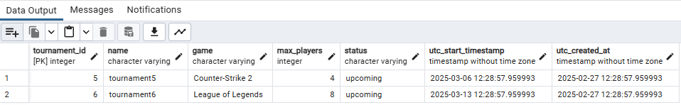

Ud fra resultatet kan vi ses, at vi har hente 2 turneringer, som starter inden for de næste 30 dage, 
hvilket er én turnering (`tournament5`) i spillet Counter-Strike 2, der starter `2025-03-06 12:28:57`
og én turnering (`tournament6`) i spillet League of Legends, der starter `2025-03-13 12:28:57`.


---

#### 2. Find det antal turneringer, en spiller har deltaget i:
```sql
SELECT COUNT(player_id) AS tournament_count 
FROM tournaments t, tournament_registrations tr
WHERE t.tournament_id = tr.tournament_id 
  AND tr.player_id = 1;
```

Queryen finder det antal af turneringer (`SELECT COUNT(player_id) as tournament_count`), 
som en spiller har deltaget i (hvor `tr.player_id = 1`), for at kunne finde det antal af turneringer, skal 
man først lave en `JOIN` mellem `tournaments` og `tournament_registrations` tabellerne, for at vide hvilke turneringer
spilleren har deltaget i (`WHERE t.tournament_id = tr.tournament_id AND tr.player_id = 1`).

##### Resultat:
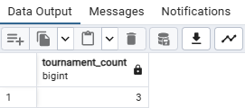

Man kan se at spilleren med `player_id = 1` har deltaget i 3 turneringer.

---

#### 3. Vis en liste over spillere registreret i en bestemt turnering:
```sql
SELECT p.player_id, username
FROM players p, tournament_registrations tr
WHERE tr.tournament_id = 1
  AND p.player_id = tr.player_id;
```

For at visse en liste over spillere (`SELECT p.player_id, username`), hvor de er registreret i en bestemt turnering, hvilket
gøres ved at joine `players` og `tournament_registrations` tabellerne, for at finde de spillere, som er registreret i en bestemt turnering,
herefter filtrere på turneringen med `tournament_id = 1`.

##### Resultat:
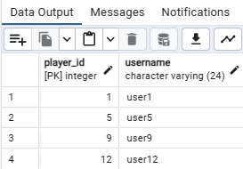

Vi kan se at der er 4 spillere: `user1 (player_id = 1), user5 (player_id = 5), user9 (player_id = 9), user12 (player_id = 12)`, som er registreret i turneringen med `tournament_id = 1`.

---

#### 4. Find spillere med flest sejre i en bestemt turnering:
```sql
SELECT p.player_id, p.username, COUNT(m.winner_id) AS wins
FROM matches m 
    JOIN players p ON m.winner_id = p.player_id
WHERE m.tournament_id = 1
GROUP BY p.player_id, p.username
ORDER BY wins DESC
```

For at finde spillerene med flest sejre i en bestem turnering, skulle vi joine `matches` og `players` tabellerne (`JOIN players p ON m.winner_id = p.player_id`),
for at finde de spillere, som har vundet kampe i en bestemt turnering (`WHERE m.tournament_id = 1`), herefter gruppere på `player_id` og `username`,
for at tælle antallet af vundne kampe (`COUNT(m.winner_id) AS wins`) og sortere dem efter antallet af vundne kampe (`ORDER BY wins DESC`).

##### Resultat:
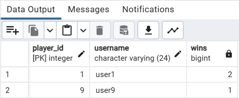

Man kan se i turneringen 1, at spilleren user1 (`player_id = 1`) har vundet 2 kampe og den 
næst højest er user9 (`player_id = 9`) med 1 vundet kamp.

---

#### 5. Hent alle kampe, hvor en bestemt spiller har deltaget:
```sql
SELECT *
FROM matches
WHERE player1_id = 4
   OR player2_id = 4;
```

Vi henter alle kampe fra `matches` tabellen (`SELECT * FROM matches`), 
hvor en bestemt spiller har deltaget, hvilket gøres ved at filtrere på `player1_id = 4 OR player2_id = 4`. 
Her var det vigtigt at tage højde for, at spilleren kan være enten `player1` eller `player2` i en kamp, da 
vi ellers kunne have overset nogle kampe.

##### Resultat:
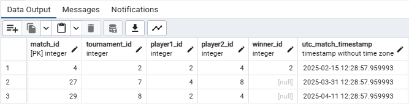

Her kan vi se at spilleren med `player_id = 4` har deltaget i 3 kampe.

---

#### 6. Hent en spillers tilmeldte turneringer:
```sql
SELECT t.*
FROM tournaments t, tournament_registrations tr
WHERE tr.player_id = 4
  AND t.tournament_id = tr.tournament_id;
```

Vi vælger at hente alt data fra `tournaments` tabellen (`SELECT t.* FROM tournaments t`), hvor efter vi 
joine `tournaments` og `tournament_registrations` tabellerne, 
for at finde de turneringer som en bestemt spiller er tilmeldt i og filtrere på `player_id = 4` 
(`FROM tournaments t, tournament_registrations tr WHERE tr.player_id = 4 AND t.tournament_id = tr.tournament_id;`)

##### Resultat:
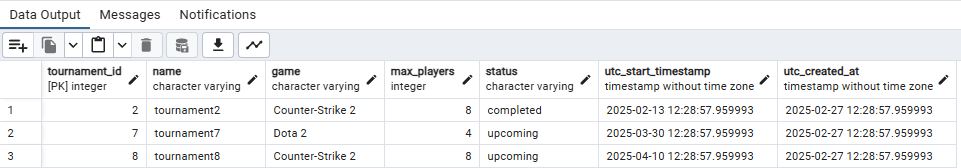

Vi kan se all turneringer som spilleren med `player_id = 4` er tilmeldt.

---

#### 7. Find de 5 bedst rangerede spillere:
```sql
SELECT player_id, username, rating
FROM players
ORDER BY rating DESC LIMIT 5;
```

Vi henter de 5 bedst rangerede spillere ud fra 
`players` tabellen (`SELECT player_id, username, rating FROM players`),
og sorterer dem efter rating i nedadgående rækkefølge (`ORDER BY rating DESC`) 
og sætter et limit på 5 spillere (`LIMIT 5`).

##### Resultat:
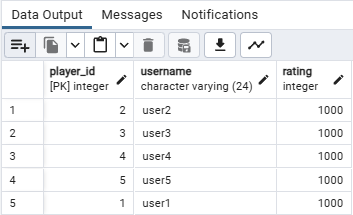

Mangler beskrivelse !!!

---

#### 8. Beregn gennemsnitlig ranking for alle spillere:
```sql
SELECT AVG(rating) AS avg_rating 
FROM players;
```

For at beregne den gennemsnitlige rating for alle spillere, 
skal tager vi den indbyggede SQL funktion `AVG()` i brug, ved at sætte `AVG(rating) AS avg_rating`,
hvilket vil give os den gennemsnitlige rating for alle spillere.

##### Resultat:
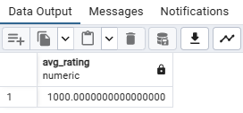

Her kan vi se at den gennemsnitlige rating for alle spillere er XXXXX.

---

#### 9. Vis turneringer med mindst 5 deltagere:
```sql
SELECT t.*, COUNT(tr.player_id) AS num_players
FROM tournaments t
    JOIN tournament_registrations tr ON t.tournament_id = tr.tournament_id
GROUP BY t.tournament_id
HAVING COUNT(tr.player_id) >= 5;
```

Vi henter alle turneringer ud fra `tournaments` tabellen (`SELECT t.*`), samt en count af antallet af spillere i hver turnering (`COUNT(tr.player_id) AS num_players`),
herefter joine vi `tournaments` og `tournament_registrations` tabellerne, for at finde antallet af spillere i hver turnering (`JOIN tournament_registrations tr ON t.tournament_id = tr.tournament_id`),
derefter gruppere (`GROUP BY t.tournament_id`) og filtrere på turneringer, som har mindst 5 deltagere (`HAVING COUNT(tr.player_id) >= 5`).


##### Resultat:
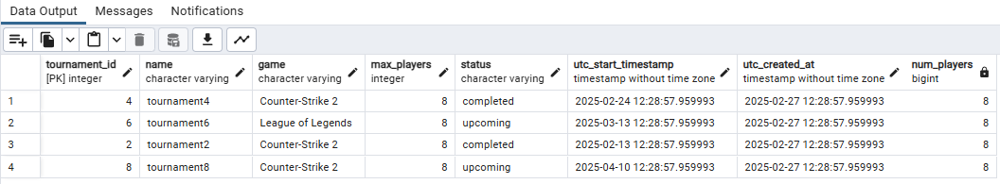

Vi kan se, at der er 4 turneringer, som har mindst 5 deltagere.

---

#### 10. Find det samlede antal spillere i systemet:
```sql
SELECT COUNT(*)
FROM players;
```

For at finde det samlede antal af spillere i systemet, anvender vi `COUNT(*)` funktionen,
som der giver antallet af rækker i `players` tabellen.

##### Resultat:
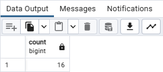

Man kan se, at der er 16 spillere i systemet.

---

#### 11. Find alle kampe, der mangler en vinder:
```sql
SELECT *
FROM matches
WHERE winner_id IS NULL;
```

For at finde alle kampe, hvor der mangler en vinder, kan vi filtrere på `winner_id IS NULL`,
når der vi henter alle kampe ud fra `matches` tabellen (`SELECT * FROM matches`).

##### Resultat:
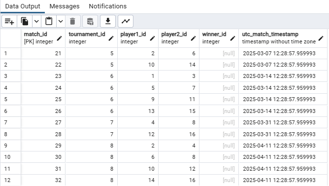

Vi kan se at der er 12 kampe, som mangler en vinder.

---


#### 12. Vis de mest populære spil baseret på turneringsantal:
```sql
SELECT game, COUNT(tournament_id) AS tournament_cnt
FROM tournaments
GROUP BY game
ORDER BY tournament_cnt DESC;
```

Vi henter alle spil ud fra `tournaments` tabellen (`SELECT game`), samt antallet af turneringer for hvert spil (`COUNT(tournament_id) AS tournament_cnt`),
derefter gruppere vi på spil (`GROUP BY game`) og sortere dem efter antallet af turneringer i nedadgående rækkefølge (`ORDER BY tournament_cnt DESC`).

##### Resultat:
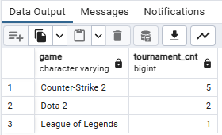

Det mest populære spil er `Counter-Strike 2`, som har 5 turneringer, derefter `Dota 2` med 2 turneringer og til sidst `League of Legends` med kun 1 turnering.

---

#### 13. Find de 5 nyeste oprettede turneringer:
```sql
SELECT *
FROM tournaments
ORDER BY utc_created_at DESC LIMIT 5;
```

Vi henter de 5 nyeste oprettede turneringer ud fra `tournaments` tabellen (`SELECT * FROM tournaments`),
og sorterer dem efter oprettelsesdato i nedadgående rækkefølge (`ORDER BY utc_created_at DESC`) og sætter et limit på 5 turneringer (`LIMIT 5`).

##### Resultat:
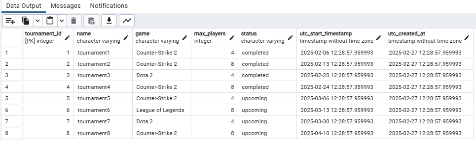

Vi kan se de 5 nyeste oprettede turneringer, som er `tournament1, tournament2, tournament3, tournament4, tournament5`.

---

#### 14. Find spillere, der har registreret sig i flere end 3 turneringer:
```sql
SELECT p.*
FROM players p
    JOIN tournament_registrations tr ON p.player_id = tr.player_id
GROUP BY p.player_id
HAVING COUNT(tr.tournament_id) > 3;
```

Vi henter alle spillere ud fra `players` tabellen (`SELECT p.*`),
og joine `players` og `tournament_registrations` tabellerne (`JOIN tournament_registrations tr ON p.player_id = tr.player_id`), 
for at finde de spillere, som har registreret sig i flere end 3 turneringer,
derefter gruppere vi på `player_id` (`GROUP BY p.player_id`) og filtrere på spillere, som har registreret sig i flere end 3 turneringer (`HAVING COUNT(tr.tournament_id) > 3`).

##### Resultat:
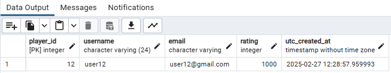

Vi kan se at spilleren user12 (`player_id = 12`) i flere end 3 turneringer.

---

#### 15. Hent alle kampe i en turnering sorteret efter dato:
```sql
SELECT *
FROM matches
WHERE tournament_id = 4
ORDER BY utc_match_timestamp ASC;
```

Vi henter alle kampe ud fra `matches` tabellen (`SELECT * FROM matches`),
derefter filtrere vi på turneringen med `tournament_id = 4` (`WHERE tournament_id = 4`) 
og sorterer dem efter kamp tidspunkt i stigende rækkefølge (`ORDER BY utc_match_timestamp ASC`).

##### Resultat:
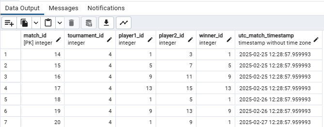

Vi kan se at der er 7 kampe i turneringen med `tournament_id = 4`, efter vi har sorteret dem efter dato.

---