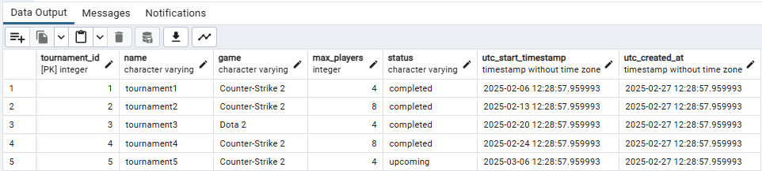

### SQL-Forespørgsler:

#### 1. Hent alle turneringer, der starter inden for de næste 30 dage:
```sql
SELECT * FROM tournaments 
WHERE utc_start_timestamp >= now() 
AND utc_start_timestamp <= now() + interval '30 day';
```
##### Resultat:


---

#### 2. Find det antal turneringer, en spiller har deltaget i:
```sql
SELECT COUNT(player_id) as tournament_count 
FROM tournaments t, tournament_registrations tr
WHERE t.tournament_id = tr.tournament_id AND tr.player_id = 1;
```
##### Resultat:


---

#### 3. Vis en liste over spillere registreret i en bestemt turnering:
```sql
SELECT p.player_id, username
FROM players p, tournament_registrations tr
WHERE tr.tournament_id = 1 AND p.player_id = tr.player_id;
```
##### Resultat:


---

#### 4. Find spillere med flest sejre i en bestemt turnering:
```sql
SELECT p.player_id, p.username, COUNT(m.winner_id) AS wins
FROM matches m
JOIN players p ON m.winner_id = p.player_id
WHERE m.tournament_id = 1
GROUP BY p.player_id, p.username
ORDER BY wins DESC
```
##### Resultat:


---

#### 5. Hent alle kampe, hvor en bestemt spiller har deltaget:
```sql
SELECT * FROM matches 
WHERE player1_id = 4 OR player2_id = 4; 
```
##### Resultat:


---

#### 6. Hent en spillers tilmeldte turneringer:
```sql
SELECT t.* from tournaments t, tournament_registrations tr
WHERE tr.player_id = 4 AND t.tournament_id = tr.tournament_id;
```
##### Resultat:


---

#### 7. Find de 5 bedst rangerede spillere:
```sql
SELECT player_id, username, rating
FROM players
ORDER BY rating DESC
LIMIT 5;
```
##### Resultat:


---

#### 8. Beregn gennemsnitlig ranking for alle spillere:
```sql
SELECT AVG(rating) as avg_rating from players;
```
##### Resultat:


---

#### 9. Vis turneringer med mindst 5 deltagere:
```sql
SELECT t.*, COUNT(tr.player_id) AS num_players
FROM tournaments t
JOIN tournament_registrations tr ON t.tournament_id = tr.tournament_id
GROUP BY t.tournament_id
HAVING COUNT(tr.player_id) >= 5;
```
##### Resultat:

---

#### 10. Find det samlede antal spillere i systemet:
```sql
SELECT COUNT(*) FROM players;
```
##### Resultat:


---

#### 11. Find alle kampe, der mangler en vinder:
```sql
SELECT * FROM matches WHERE winner_id is NULL;
```
##### Resultat:


---


#### 12. Vis de mest populære spil baseret på turneringsantal:
```sql
SELECT game, COUNT(tournament_id) as tournament_cnt
FROM tournaments
group by game
order by tournament_cnt DESC;
```
##### Resultat:


---

#### 13. Find de 5 nyeste oprettede turneringer:
```sql
SELECT *
FROM tournaments
order by utc_created_at DESC;
LIMIT 5;
```
##### Resultat:


---

#### 14. Find spillere, der har registreret sig i flere end 3 turneringer:
```sql
SELECT p.*
FROM players p
JOIN tournament_registrations tr ON p.player_id = tr.player_id
GROUP BY p.player_id
HAVING COUNT(tr.tournament_id) > 3;
```
##### Resultat:


---

#### 15. Hent alle kampe i en turnering sorteret efter dato:
```sql
SELECT *
FROM matches
WHERE tournament_id = 4
ORDER BY utc_match_timestamp ASC;
```
##### Resultat:


---