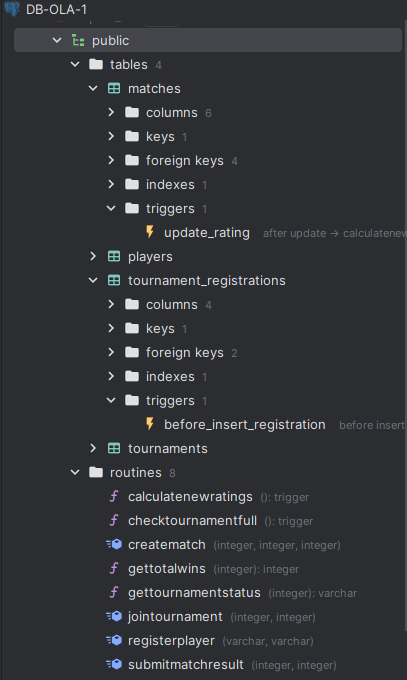
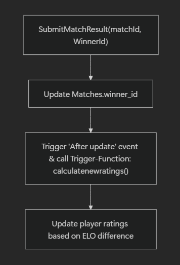

# Dokuentation af part 3: funktionelle functions, procedures og triggers

Som udgangspunkt skal vi tjekke om vores værktøjer bliver registreret korrekt og til den rigtige database.

Som kan ses på følgende billede, får vi med vores SQL scripts skabt vores diverse funktioner

<div style="display: flex; align-items: center;">
    
    <ul>
        <p style="font-size: 110%">
    Billedet til venstre viser vores nuværende opsætning af databasen, heraf med de 4 ønskede tabeller til Esport. Endvidere har vi med vores diverse scripts i folderen <a href="../sql/create_script.sql">SQL</a>
        </p>
        <hr>
        <li>Triggers er skabt med de ønskede navne som fremstår af opgaven</li>
        <li>Procedures og Functions er også skabt med rigtige navne og fremstår nederst i folderen "routines"</li>
        <li> Vi har med vores scripts (når kørt i den rigtige røkkefølge) gjort det nemt at få de diverse værktøjer sat op.
        </li>
<hr>
        <p>
        Keywordet <span style=" color:orange; font-weight: bold; font-size:110% " >Create</span> i SQL sikrer at en entitet bliver skabt. Dette er universelt for Relationer, funktioner, procedures og triggers mm. og skaber som typisk en genandvendelig instans af "noget" i databasen.
        </p> </ul>
</div>

---
Med vores instanser nu skabt, vil denne dokumentation demonstrere og sikre at funktionaliterne kører som de skal og at data-persistence er modereret korrekt.
Denne dokumentation vil købe igennem de forskellige operations-instanser vi har lavet, redegøre for dem og vise et eksempel på deres brug og validering.

## Stored procedures
Kort sagt er stored procedures SQL queries/interaktioner, pakket ind i en instans man kan kalde med
```
CALL MyProcedure()
```
Som typisk kan procedures ikke bruges i andre queries, og er udelukkende for at 'gemme' længere kode-eksekveringer til simple "calls".
<div style="border: 1px solid #ccc; border-radius: 8px; padding: 16px; display: flex; align-items: center; background-color:rgb(43, 40, 40);">
    
    <div>
        <strong>Note:</strong> med OUT (output) kan man alligevel bruge procedures i andre queries. Ellers er Functions den bedste måde at håndtere komplekse queries, ligesom Views forenkler dem.
    </div>
</div>

---
### Eksempel: Submitting a Match result



1. Metoden `SubmitMatchresult` kaldes:
```sql
create procedure submitmatchresult(IN matchid integer, IN winnerid integer)
    language plpgsql --postgreSQL dialekt
as
$$
BEGIN
    UPDATE matches
    SET winner_id = winnerId
    WHERE match_id = matchId;

    -- Denne metode opdaterer kun winner_id, resten af funktionaliteten er sat over i trigger funktionen.
END;
$$;
```


## Gamle noter til part 3

Har lavet en persistScript.sql så jeg bare kan køre den når jeg vil redo persistence. Har ændret lidt i den så der findes tournaments med ferre end max anatallet af spillere så jeg kan teste at joine en full tournament vs. en åben en, osv.

## Korrekt brug

Start først med at køre [create script](../sql/create_script.sql) som indeholder tables og triggers (og deres trigger functions inkluderet også.)

derefter kan du køre [persistScriptet](./persistScript.sql) hvis du vil, da den skaber en function der kører det samme som fill_script.sql gør, bortset fra mit script har mangler så man kan tilmælde sig tournaments osv; så ikke alle tournaments bare er fulde, og den laver en function mere.

## Efter du så har kørt persist og create
* kør [functions scriptet](./functions.sql)
* Til sidst [scriptet med procedures](./procedures.sql).